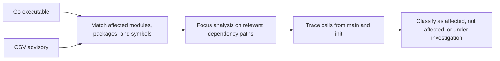

# govulnreach

`govulnreach` checks whether a vulnerability from the OSV database affects a Go executable. It follows the program's calls to see whether the vulnerable code is reachable.

The result is an [OpenVEX](https://openssf.org/projects/openvex) document with the affected components, dependency paths and call paths found during analysis.

## Installing

```bash
go install github.com/samuelvl/govulnreach@latest
```

## Example

The following example checks whether [`GO-2024-2687`](https://osv.dev/vulnerability/GO-2024-2687), an HTTP/2 denial-of-service vulnerability, affects `osv-scanner`:

```bash
govulnreach \
  --source https://github.com/google/osv-scanner.git#v1.7.0 \
  --package ./cmd/osv-scanner \
  --advisory GO-2024-2687
```

This command generates an [OpenVEX](https://openssf.org/projects/openvex) document that confirms the `net/http` package is vulnerable because `osv-scanner` reaches affected HTTP/2 transport code:

```text
github.com/google/osv-scanner/cmd/osv-scanner.main
  -> github.com/google/osv-scanner/cmd/osv-scanner.run
  -> github.com/google/osv-scanner/cmd/osv-scanner/scan.action
  -> github.com/google/osv-scanner/pkg/osvscanner.DoScan
  -> github.com/google/osv-scanner/pkg/osvscanner.makeRequest
  -> github.com/google/osv-scanner/pkg/osv.MakeRequest
  -> github.com/google/osv-scanner/pkg/osv.MakeRequestWithClient
  -> net/http.Client.Do
  -> net/http.Client.send
  -> net/http.Transport.RoundTrip
  -> net/http.http2Transport.RoundTrip
  -> net/http.http2Transport.RoundTripOpt
  -> net/http.http2noDialClientConnPool.GetClientConn
```

This result confirms reachability. It does not prove that an attacker can trigger every path.

## How it works



The analyzer first removes advisory entries that do not apply to the dependency graph or selected versions. It then analyzes only code that can lead to the remaining affected symbols.

## Difference from govulncheck

[`govulncheck`](https://pkg.go.dev/golang.org/x/vuln/cmd/govulncheck) is the standard tool for scanning a project against the Go vulnerability database.

`govulnreach` can be used during security triage to collect reachability evidence for one finding. It loads dependency metadata but limits expensive SSA and call-graph analysis to packages and symbols related to that advisory. This reduces time and memory use on large codebases.
